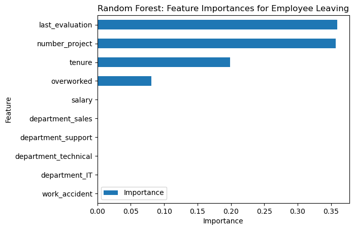

# Employee Attrition Prediction: Data-Driven Insights for HR Retention Strategies

### Project Overview

This project analyzes HR data from a large consulting firm to identify factors contributing to employee attrition and build predictive models to forecast employees leaving. This project aims to leverage machine learning techniques to provide data-driven recommendations to improve employee retention. The best-performing model, Random Forest, highlights key retention drivers such as workload, tenure, and performance evaluations.

### Business Understanding

Employee turnover is costly due to recruitment, onboarding, and productivity loss. HR wants to understand what influences employees to leave and implement strategies to improve retention. By predicting attrition, the company can proactively address key concerns and foster a better work environment.

### Data Understanding

The dataset consists of anonymized employee records, including factors such as performance evaluation scores, tenure, project workload, and work hours. Feature engineering was applied to create new variables, such as an "overworked" indicator.

### Modeling and Evaluation

Three models were implemented and evaluated:

- Logistic Regression
- Decision Tree
- Random Forest (Best Model)

| Model                                    | Precision | Recall   | F1       | Accuracy | AUC      |
| ---------------------------------------- | --------- | -------- | -------- | -------- | -------- |
| Decision Tree                            | 0.914552  | 0.916949 | 0.915707 | 0.971978 | 0.969819 |
| Random Forest                            | 0.950023  | 0.915614 | 0.932467 | 0.977983 | 0.980425 |
| Decision Tree (With Feature Engineering) | 0.856693  | 0.903553 | 0.878882 | 0.958523 | 0.958675 |
| Random Forest (With Feature Engineering) | 0.866758  | 0.878754 | 0.872407 | 0.957411 | 0.96481  |

Feature Importances (Random Forest):

The below plot shows that performance evaluation scores, number of projects assigned, employee tenure and workload (overworked indicator) are the most important factors in determining employee attrition. The overall model performed with 96% accuracy and 88% recall.

### Conclusion & Recommendations

The findings confirm that overwork and lack of career progression are significant drivers of attrition. To improve retention, the following actions are recommended:

- Cap project assignments to prevent burnout.
- Investigate the 4-year tenure dissatisfaction trend and offer career advancement opportunities.
- Ensure transparent communication regarding workload expectations and overtime policies.
- Revise performance evaluation criteria to reward effort more equitably.
- Conduct company-wide discussions to reassess work culture and employee well-being.
